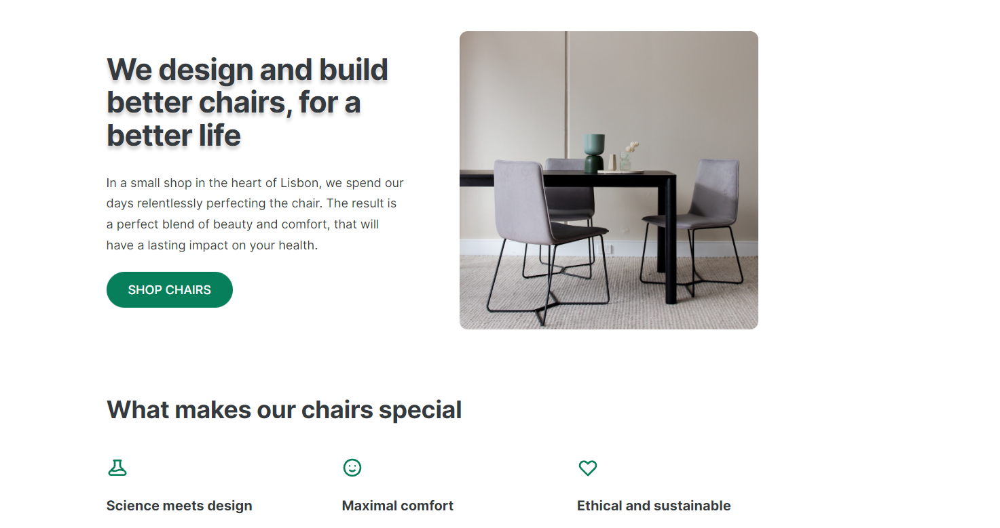
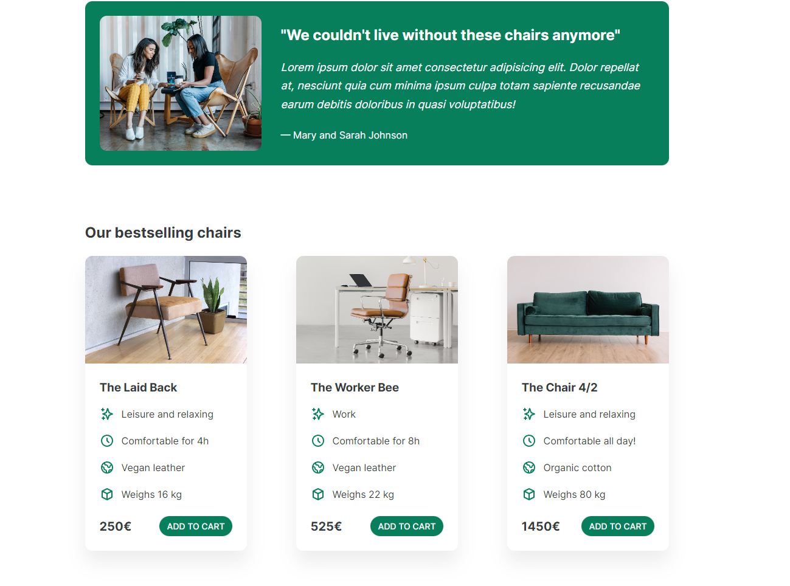

# Lisabon-chairs-project

This is a solution to the [Build Responsive Real-World Websites with HTML and CSS](https://www.udemy.com/course/design-and-develop-a-killer-website-with-html5-and-css3/) 

## Table of contents

- [Overview](#overview)
  - [Screenshot](#screenshot)
  - [Links](#links)
- [My process](#my-process)
  - [Built with](#built-with)
- [Author](#author)
- [Acknowledgments](#acknowledgments)

## Overview

### Screenshot

### Links

- Solution URL: [Solution](https://github.com/nikamerebashvili95/Lisabon-chairs-project)
- Live Site URL: [GitHub Live URL](https://nikamerebashvili95.github.io/Lisabon-chairs-project/)

## My process

### Built with

- Semantic HTML5 markup
- CSS custom properties
- Flexbox
- Desktop workflow

## Author

- GitHub - [Nika Merebashvili](https://github.com/nikamerebashvili95)

## Acknowledgments

special thanks goes to Jonas Schmedtmann, for the opportunity to learn web development

- Jonas Schmedtmann: [Twitter](https://twitter.com/jonasschmedtman)
- Udemy: [Udemy](https://www.udemy.com/course/design-and-develop-a-killer-website-with-html5-and-css3/)
